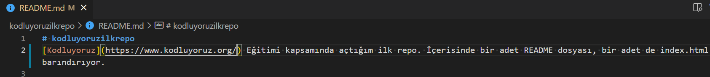

# kodluyoruzilkrepo
[Kodluyoruz](https://www.kodluyoruz.org/) Eğitimi kapsamında açtığım ilk repo. İçerisinde bir adet README dosyası, bir adet de index.html barındırıyor.


#Installation

Öncelikle projeyi clonelayın.

```git clone https://github.com/ysfarslanon/kodluyoruzilkrepo.git```

#Usage

Projeyi cloneladıktan sonra Visual Studio Code programında açınız.

Linux için:

```
cd kodluyoruzilkrepo
code .
```

#Contributing

Pull requesler kabul edilir. Büyük değişiklikler için, lütfen önce neyi değiştirmek istediğinizi tartışmak için bir konu açınız.

#Licence <br/>
[MIT](https://choosealicense.com/licenses/mit/)